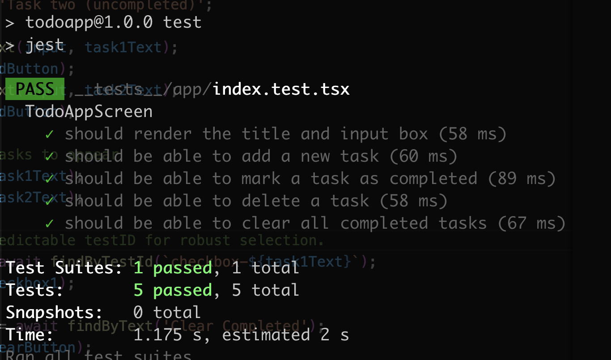

# React Native To-Do App

---

[**English**](./README.md) | [**中文**](./README.zh-CN.md)

## 🇬🇧 English

A simple yet feature-rich to-do list application built with React Native and Expo, focusing on a clean UI, smooth animations, and a well-structured, test-driven codebase.

## Demo

The following GIF showcases the core functionalities of the app. Click the image to view the full HD video with sound.

[](https://pub-0a4cfd1889fc48acafea1624679cfdef.r2.dev/todo_demo_video.mp4)


## Features

- **User Authentication**: Complete user registration and login system with secure local storage.
- **User Statistics**: Track your productivity with 7-day login count and task creation statistics.
- **Add Tasks**: A simple input field to quickly add new tasks to the list.
- **Task List**: A clear, scrollable list displaying all tasks.
- **Mark as Complete**: Tap the checkbox to toggle a task's completion status. Completed tasks are visually marked with a strikethrough.
- **Delete Tasks**: A dedicated button on each task item to instantly remove it.
- **Clear Completed**: A convenient button at the bottom to remove all completed tasks at once.
- **Data Persistence**: Your tasks and user data are saved locally on the device and will be available even after closing and reopening the app.
- **Smooth Animations**: All actions—adding, completing, and deleting tasks—are accompanied by fluid animations to enhance the user experience.
- **Performance**: Built with `FlatList` to ensure high performance, even with very long lists of tasks.

## Tech Stack

- **Framework**: React Native with Expo
- **Language**: TypeScript
- **Navigation**: Expo Router
- **Animation**: Moti & React Native Reanimated
- **Data Persistence**: `@react-native-async-storage/async-storage`
- **Testing**: Jest & React Native Testing Library
- **State Management**: React Hooks (State, Effect, Callback) & Custom Hooks

## Design Decisions & Implementation

### Code Structure

The project follows a clean, modular architecture to separate concerns:

- **`/app`**: Contains the screen layouts and navigation logic, managed by Expo Router. `index.tsx` serves as the main todo screen, while `auth.tsx` handles user authentication. The navigation is protected and automatically redirects users based on their authentication status.
- **`/components`**: Holds reusable, "dumb" UI components (`TaskItem`, `AddTaskInput`, `LoginForm`, `RegisterForm`, etc.). These components receive data and callbacks as props and are not concerned with business logic.
- **`/hooks`**: Centralizes all business logic. The `useTasks.ts` custom hook manages the entire state of the task list, while `useAuth.ts` handles user authentication, registration, login, logout, and user statistics tracking.
- **`/types`**: A dedicated `index.ts` file defines shared TypeScript interfaces, like the `Task`, `User`, and `UserStats` types, ensuring type safety across the application.

### Data Persistence

Both task data and user information are persisted using `@react-native-async-storage/async-storage`:

**Task Management**: The `useTasks` hook handles task persistence automatically:
1. On initial mount, it attempts to load a JSON string of tasks from storage.
2. Any modification to the tasks array (add, toggle, delete) triggers a `useEffect` hook that serializes the array back into a JSON string and saves it to storage.

**User Authentication**: The `useAuth` hook manages user data persistence:
1. User registration creates a new account and stores encrypted user data locally.
2. Login verification checks credentials against stored user data.
3. User statistics (7-day login count and task creation count) are tracked and automatically updated.
4. All user data is stored securely in separate storage keys to maintain data integrity.

### Animations

Animations are implemented using `Moti`, which provides a simple yet powerful declarative API on top of `React Native Reanimated`.
- **Adding/Deleting**: `MotiView` with `from`, `animate`, and `exit` props creates a smooth fade-and-scale effect for items entering or leaving the list.
- **Layout Changes**: `LayoutAnimation` is used to animate the re-ordering of the list when tasks are added or removed, creating a seamless transition.
- **Strikethrough**: The strikethrough effect on completed tasks is achieved by animating the `width` of a 1px-high `MotiView` from `0%` to `100%`, creating a "drawing" effect.

## Getting Started

### Prerequisites

- Node.js (LTS version recommended)
- Expo Go app on your iOS or Android device (for physical device testing)
- Git

### Installation & Running

1. **Clone the repository:**
   ```bash
   git clone <your-repository-url>
   cd TodoApp
   ```

2. **Install dependencies:**
   ```bash
   npm install
   ```

3. **Start the development server:**
   ```bash
   npx expo start
   ```

4. **Run on your device:**
   - Scan the QR code shown in the terminal with the Expo Go app.
   - Or, press `a` to run on an Android emulator, or `i` to run on an iOS simulator.

## Running Tests

To run the suite of unit and integration tests, use the following command:
```bash
npm test
```

