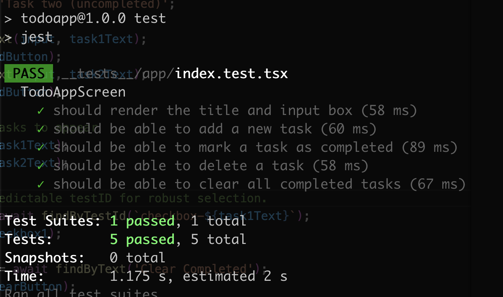

# React Native 待办事项应用

---

[**English**](./README.md) | [**中文**](./README.zh-CN.md)

## 🇬🇧 中文

一个简洁而功能丰富的待办事项列表应用，使用 React Native 和 Expo 构建。项目重点关注干净的用户界面、流畅的动画效果以及结构清晰、测试驱动的代码库。

## 功能演示 (Demo)

下面的 GIF 动画展示了应用的核心功能。点击图片可以查看带声音的完整高清 MP4 视频。

[](https://pub-0a4cfd1889fc48acafea1624679cfdef.r2.dev/todo_demo.mp4)

## 功能特性

-   **用户认证**: 完整的用户注册和登录系统，支持安全的本地存储。
-   **用户统计**: 通过 7 天登录次数和任务创建统计跟踪您的生产力。
-   **添加任务**: 通过简单的输入框快速添加新任务。
-   **任务列表**: 清晰、可滚动的列表，用于显示所有任务。
-   **标记完成**: 点击复选框即可切换任务的完成状态。已完成的任务会以删除线进行视觉标记。
-   **删除任务**: 每个任务项上都有一个专门的按钮，可以立即将其移除。
-   **清除已完成**: 位于底部的便捷按钮，可以一次性移除所有已完成的任务。
-   **数据持久化**: 您的任务和用户数据会保存在设备本地，即使关闭并重新打开应用后，数据依然存在。
-   **流畅动画**: 添加、完成和删除任务等所有操作都伴随着流畅的动画，以增强用户体验。
-   **性能优化**: 使用 `FlatList` 构建，确保即使在任务列表非常长的情况下也能保持高性能。

## 技术栈

-   **框架**: React Native with Expo
-   **语言**: TypeScript
-   **导航**: Expo Router
-   **动画**: Moti & React Native Reanimated
-   **数据持久化**: `@react-native-async-storage/async-storage`
-   **测试**: Jest & React Native Testing Library
-   **状态管理**: React Hooks (State, Effect, Callback) & 自定义 Hooks

## 设计决策与实现细节

### 代码结构

项目遵循清晰的模块化架构，以实现关注点分离：

-   **`/app`**: 包含由 Expo Router 管理的屏幕布局和导航逻辑。`index.tsx` 作为主屏幕，负责将各个组件组合成完整的 UI。
-   **`/components`**: 存放可复用的、“纯粹”的 UI 组件（如 `TaskItem`, `AddTaskInput` 等）。这些组件通过 props 接收数据和回调函数，不关心业务逻辑。
-   **`/hooks`**: 集中管理所有业务逻辑。`useTasks.ts` 这个自定义 Hook 管理了任务列表的全部状态，包括加载、保存、添加、切换和删除任务。这种方法使屏幕组件保持简洁，专注于渲染工作。
-   **`/types`**: 专用的 `index.ts` 文件定义了共享的 TypeScript 接口（如 `Task` 类型），确保了整个应用的类型安全。

### 数据持久化

任务数据和用户信息都使用 `@react-native-async-storage/async-storage` 进行持久化：

**任务管理**: `useTasks` Hook 会自动处理任务持久化：
1.  在组件初次挂载时，它会尝试从存储中加载任务数据的 JSON 字符串。
2.  对任务数组的任何修改（添加、切换、删除）都会触发一个 `useEffect` Hook，该 Hook 会将数组序列化为 JSON 字符串并保存回存储中。

**用户认证**: `useAuth` Hook 管理用户数据持久化：
1.  用户注册会创建新账户并将加密的用户数据存储在本地。
2.  登录验证会检查凭据与存储的用户数据。
3.  用户统计（7 天登录次数和任务创建次数）会被跟踪并自动更新。
4.  所有用户数据都安全地存储在独立的存储键中，以维护数据完整性。

### 动画实现

动画效果通过 `Moti` 实现，它在 `React Native Reanimated` 之上提供了一个简单而强大的声明式 API。
-   **添加/删除**: `MotiView` 的 `from`、`animate` 和 `exit` 属性为列表项的进入和离开创建了平滑的淡入淡出和缩放效果。
-   **布局变化**: `LayoutAnimation` 用于在添加或删除任务时，为列表的重新排序提供动画，创造了无缝的过渡效果。
-   **删除线**: 已完成任务的删除线效果是通过对一个 1 像素高的 `MotiView` 的 `width` 属性进行从 `0%` 到 `100%` 的动画来实现的，从而创造出一种“绘制”效果。

## 开始使用

### 环境要求

-   Node.js (推荐使用 LTS 版本)
-   iOS 或 Android 设备上的 Expo Go 应用 (用于真机测试)
-   Git

### 安装与运行

1.  **克隆仓库:**
    ```bash
    git clone <your-repository-url>
    cd TodoApp
    ```

2.  **安装依赖:**
    ```bash
    npm install
    ```

3.  **启动开发服务器:**
    ```bash
    npx expo start
    ```

4.  **在您的设备上运行:**
    -   使用 Expo Go 应用扫描终端中显示的二维码。
    -   或者，按 `a` 在 Android 模拟器上运行，或按 `i` 在 iOS 模拟器上运行。

## 运行测试

要运行单元测试和集成测试，请使用以下命令：
```bash
npm test
```

